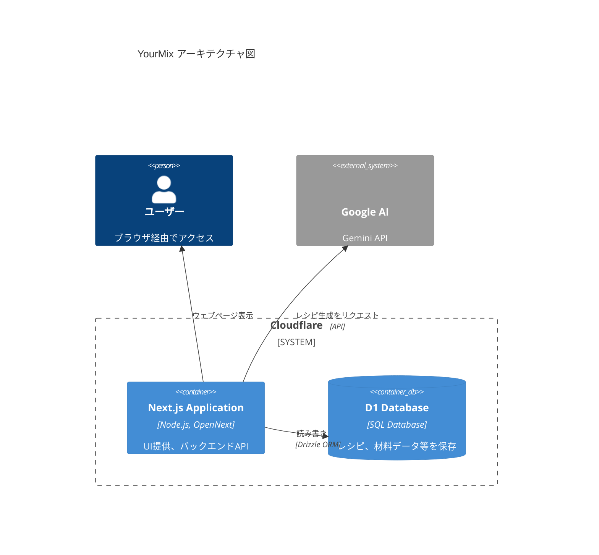

## 目次

## 概要

個人的にカクテルが好きなので、レシピを検索するウェブアプリを作成しました。ドッグフーディングできることは重要だと考えているので、自分の趣味を反映しました。

- [公開URL](https://yourmix.hndyu.workers.dev/)
- [リポジトリ](https://github.com/hndyu/yourmix)

他のレシピサイトとの差別化として、材料を指定するとAIがオリジナルのレシピを生成してくれる機能を中心にしています。一般的なレシピ検索機能も備えていますが、あくまでメインはAIが作成する、実質的に無限のレシピにあります。

作り始めた時期は2025年5月ですが、独学での制作に限界を感じたため、職業訓練の授業が十分進むまで保留していました。

納得いくまで作り込んでからリリースするつもりでいましたが、ポートフォリオが必要のため、未完成のまま一旦公開しています。今後は随時記事を更新/追加公開していこうかと考えています。

## アーキテクチャ

## 技術選定

- エディタ：いくつか試しており、まだひとつに定めてはいません。現時点ではレート制限を考えてGemini CLIを使う機会が増えているため、どのエディタを選ぶかは重要ではなくなってきています。
  - VS Code
    - 一時期は盤石の地位が脅かされていると感じていましたが、AI関連のオープンソース化・アップデートにより巻き返しが進んでいると思います。今でも大きいシェアを持っているでしょうし、結果として真っ先にMCPなどの対応がされるなどの安心感から、手堅い選択肢だと考えるようになりました。
    - ただ、Copilot無料枠で選択できるモデルが少々力不足なので、最近では開発に使用していません。
  - Cursor
    - ビジュアルエディタの搭載は興味深い方向性だと感じました。これがうまくいくかはわかりませんが、新しいUXを生み出そうとする気概に好感を持ちます。
    - とはいえ、月単位のレートリミットにあっという間に到達してしまうため、サブで使用することもあるエディタという立ち位置です。
    - また、VS Codeからショートカットキーがいくつか変更されているので戸惑います。
  - Google Antigravity
    - 現在のメインエディタです。Google謹製でありGemini 3の能力をフルに活かせるであろうという安心感もさることながら、週単位という比較的緩いレートリミットで使用できるのが嬉しいポイントです。Gemini CLIとあわせて使用することで、無料でもAIを潤沢に使用した開発が行えています。Claude 4.5世代も使わせてくれるのが大変嬉しいので、このままを維持してほしいところです。
    - Gemini.mdで指定しても英語でArtifactsを出力してくることがあり、AIとのコミュニケーションコストがかかりがちなのが難点です。
- ランタイム：Node.js
- ホスティング：Cloudflare Workers
  - 当初デプロイに失敗し続けていましたが、[公式ドキュメント](https://developers.cloudflare.com/workers/framework-guides/web-apps/nextjs/)をきちんと読み直したところコマンドからの実行が正解でした。
  - [OpenNext](https://opennext.js.org/)を使ってNext.js製アプリをデプロイするのですが、互換性が完全ではないためなのかicon.tsxの配置時などエラーが起きることがあり、まだ安定性に欠ける印象です（OpenNextが原因かどうかの確信はありません）。
- データベース：Cloudflare D1
  - 一定の無料利用が可能であること、Workersとの連携を考えての採用です。
- ORM
  - Drizzleを採用しました。Prismaは職業訓練校で使用したので、せっかくなら別のものを使ってみようという考えです。選定の際には[Github Star History](https://www.star-history.com)を参考にすることがままありますが、今のところ両者の伸びは平行線のようです。健全な競争があるのはいいことですね。
- フレームワーク：Next.js
  - ウェブアプリ開発におけるデファクトスタンダードに近いかと考えているため、経験を積むためにも導入しました。機能をすべて使いこなせるとは思いませんが、できるだけ学んでいきたいと思います。
- リンター・フォーマッタ：Biome
  - 個別にESlintやPrettierを導入するより楽でした。configやプラグインの設定がほとんど不要というだけでも新規プロジェクトに採用したくなります。
- UIライブラリ：MUI
  - 以前から気になっていたので採用しました。そのままのデザインだとカクテルのサイトとしてはミスマッチになりそうだと考え、全体的に色彩を調整しています。
  - Gemini 2.5世代でも知識が古いようで、生成するコードがMUI v7の仕様に沿っていないという事態が頻発します。[公式ドキュメント](https://mui.com/material-ui/migration/upgrade-to-grid-v2/)に従えば解決しますが、モデル側のアップデートで解消することを期待しています。
- テスト：Playwright、Vitest
  - まだ不慣れなため、主にAIの書くテストに頼っています。Github ActionsでPlaywrightを実行するとエラーが頻発したので、やむなく手動での実行のみ行っています。

## 今後

技術的に難しいものもありますが、[仕様書](https://github.com/hndyu/yourmix/tree/master/docs)に記載がある内容は実装を進めていきたいと思います。
直近で対応したいもの・現在対応中のものはGithub Projectsで管理するようにしています。
