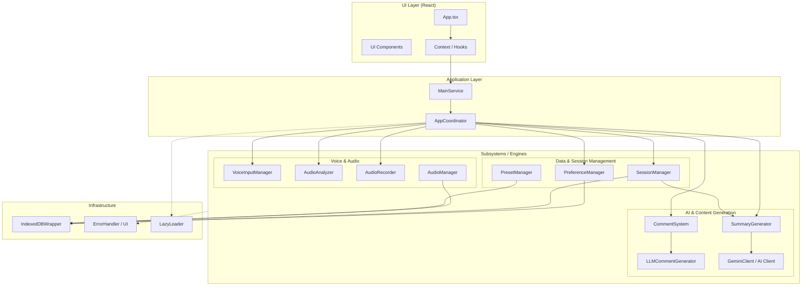

## 目次

## 概要
AIコメントでライブ配信を再現する、カジュアルな音声会話ができるウェブサービスです。およそ1ヶ月で制作しました。

- [公開URL](https://monolog-live.hndyu.workers.dev/)
- [リポジトリ](https://github.com/hndyu/MonologLive)

[ラバーダック・デバッグ](https://ja.wikipedia.org/wiki/%E3%83%A9%E3%83%90%E3%83%BC%E3%83%80%E3%83%83%E3%82%AF%E3%83%BB%E3%83%87%E3%83%90%E3%83%83%E3%82%B0)とVTuberの雑談配信をモデルとして作りました。

ユーザーのやることは基本方針（AIとどんな会話がしたいか）とコメントのロール（どんなコメントを生成する役割か）を決め、あとはマイクに向かって好きなことを喋るだけです。設定や話した内容に基づき、AIが文脈に応じたコメントを生成し、最終的には要約を表示してくれます。

例えばデフォルトプリセットには「思考パートナー」という基本方針があり、ユーザーはAIとの対話を通して深く意識することなく内省が可能になります。私はよく頭の中で仮想の相手と会話して思考の整理などをしていますが、結局自己対話でしかないため、当然自分の想定を超える返事はやってこず、壁打ち相手としては物足りないと感じる瞬間もありました。この点、AIを使うことで今までにない意見や価値観に出会えるかもしれないと考えたことからプロジェクトをスタートさせました。


ChatGPTやGeminiでも似たようなことはできるかもしれません。わざわざMonolog Liveを使うほどの差別化要因ではないかもしれませんが、既存のAIサービスと比べたときの違い（≠優位点）は以下です。
- 入力をテキストで行おうとすると手間暇がかかるのでMonolog Liveでは音声入力
- 一方AIのコメントはテキストで行われるので、入力とフィードバックに非対称性がある
  - フィードバックが音声だと一度に1つしか受け取れず、相手の発言終了まで待たなくてはならない
  - テキストのコメントであれば聞くよりも多くのフィードバックを素早く受け取れる
- AI の役割やコメントの性格を自由度高めにカスタム可能
  - ChatGPT等のカスタムインストラクションでも可能そうだが、Monolog Liveはプリセットの保存・編集・切り替えまでできる
- 発話内容と要約を楽に保存可能（音声・マークダウン・JSON）
  - 自分の価値観などを言語化・ファイル化し、AIに読み込ませて二次利用しやすくなる（いわゆるセカンドブレイン）
  - ChatGPT等でも指示すれば可能なことではあるが、Monolog Liveは確実に構造化されたデータを保存できる

## 機能

- **リアルタイム音声入力**: Web Speech APIを使用した連続音声認識
- **オーディオ録音**: セッション中の発言を自動録音
- **コメントシミュレーション**: 複数の異なるパーソナリティロールを持つAI生成コメント（Google Gemma統合）
- **セッションサマリー**: Gemini API を使用した自動会話要約
- **カスタマイズ可能なプリセット**: 基本方針とコメント担当（ロール）の複数の組み合わせを保存し、切り替え可能
- **モダン UI**: React と Tailwind CSS で構築された洗練されたインターフェース
- **ローカルのみにデータを保存**: localStorageとIndexedDBを使用したクライアント側データの永続化

## アーキテクチャ



## プロジェクト構造

```
├── src/
│ ├── types/
│ │ └── core.ts # Core TypeScript 型定義
│ ├── interfaces/
│ │ ├── voice-input.ts # 音声入力インターフェース
│ │ ├── audio-recording.ts # オーディオ録音インターフェース
│ │ ├── comment-generation.ts # コメント生成インターフェース
│ │ ├── session-management.ts # セッション管理インターフェース
│ │ └── summary-generation.ts # サマリー生成インターフェース
│ ├── storage/
│ │ └── indexeddb-wrapper.ts # クライアントサイドストレージ用の IndexedDB ラッパー
│ ├── ui/
│ │ ├── components/ # React コンポーネント (Tailwind CSS)
│ │ ├── layouts/ # ページレイアウト
│ │ └── global.css # グローバルスタイル (Tailwind CSS)
│ ├── preference/
│ │ ├── default-presets.ts # デフォルトプリセット
│ │ ├── preference-manager.ts # ユーザー設定ロジック
│ │ └── preset-manager-impl.ts # カスタムプリセット保存ロジック
│ ├── main-service.ts # メインアプリケーションサービス (コアブリッジ)
│ ├── main.tsx # React エントリポイント
│ ├── App.tsx # ルート React コンポーネント
├── tests/
│ ├── unit/ # コンポーネントとロジックのユニットテスト
│ ├── setup.ts # Vitest のセットアップとモック
│ └── *.test.ts # 統合テストとプロパティベーステスト
├── index.html # メイン HTML ファイル
├── package.json # プロジェクトの依存関係とスクリプト
├── tsconfig.json # TypeScript 設定
├── vite.config.ts # Vite/Vitest 設定
```

## 技術選定

- エディタ：
  - [Kiro](https://kiro.dev/)
    - AWSがリリースしたAI統合IDEです。GithubのSpecKitと同じく、仕様駆動開発を特徴としています。
    - 利用開始時に500クレジットが付与されるため、新規プロジェクトにはぴったりだと思い使い始めました。結局100クレジットほどは別のプロジェクトで使用してしまいましたが、残りの400 + 毎月の割当50クレジットを使ってAIに任せるだけで当初の予定していた機能は実装でき、ほとんどのテストにもパスできるところまでは達成できました。
    - こちらのやることといえばAIの操縦と確認作業だけともいえるので、格段に開発速度が早く、それでいて品質が十分高いことを実感しています。
    - AmazonがAnthropicに投資しているためかClaudeがデフォルトなのも出来のよさに貢献しているかと思います。
    - とはいえ、毎月50クレジットはあっという間に使い切ってしまうため、普段使いはせず、Geminiで解決しにくい問題に当たった際にKiroを起動することがある、というところに落ち着きました。
    - プロンプトはChatGPTに手伝ってもらいました。当セクション下部に記載しています。
  - Google Antigravity + Gemini CLI
    - メインで使用しています。
- 言語：TypeScript
- ストレージ：
  - localStorage
  - IndexedDB（[idbライブラリ](https://github.com/jakearchibald/idb)）
- ランタイム：Node.js
- ホスティング：Cloudflare Workers
- ビルドツール：[Vite](https://github.com/vitejs/vite)
- リンター・フォーマッタ：Biome、[commitlint](https://github.com/conventional-changelog/commitlint)
  - [lefthook](https://github.com/evilmartians/lefthook)を導入し以下のGitフックを使用しています。
    - コミット前：npx tsc --noEmitとbiomeによりエラーや警告を発見します。
    - コミットメッセージ：commitlintを実行し、Conventional Commitsを強制します。
    - プッシュ前：npm auditとnpm testを実行してパッケージの脆弱性対応とコード品質の担保を行います。
- テスト：Vitest、[fast-check](https://github.com/dubzzz/fast-check)
  - Property Based Testingという概念を知ったため、fast-checkを導入しています。相変わらずテスト作成はAIに頼っている部分がありますが、テストが充実するほどバグが発生しにくいのは体感としてありますので、今後も使い続けていきたいです。
- API：
  - Web Speech API：リアルタイム音声文字起こし
  - Web Audio API：発話の検知や音量モニタリング
  - MediaRecorder API：音声の録音・保存
- AIサービス：
  - Gemma API（セッション中のコメント生成）
  - Gemini API（セッション終了後の要約生成）

### Kiroプロンプト
改めて見返せば、当初とはずいぶん変わった部分もあることに気付かされます。

今でこそユーザーがコメント生成ボタンを押すことでAIがコメントを作りますが、もとは発言内容に応じてタイミングを自動判断しAIが動く仕様でした。また、LLMだけではなくルールベースのコメントも賑やかしとして存在しており、今よりもライブ配信らしい雰囲気を意識していました。

<details>
  <summary>プロンプト内容</summary>

```markdown
# 1. プロジェクト概要

あなたは **MONOLOG LIVE** という Web サービスを実装する AI エージェントです。

MONOLOG LIVE は、

- ユーザーが音声で独り言や雑談をする
- それに対して **AI が ” 配信のコメント欄 ” として反応する**
- ユーザーは自分の思考・発言や AI からの指摘などを通して気づきを得たり、単にストレス発散をする
- セッション終了後に **AI が勝手に内容をまとめて記録を作る**

というサービスです。

重要な思想は以下です：

- ユーザーは雑談レベルの気軽さで会話するだけ
- セッション中、AI は人間らしく振る舞いコメントする
- **雑談が成立することが最優先**
- 「意味」「整理」「結論」は**最後だけ**でよい

---

# 2. 技術・制約条件（必須）

## 2.1 コスト制約

- 基本無料を前提とする
- 常時の外部 API 利用は不可
- 高コストな LLM 呼び出しは **セッション終了時のみ** が望ましい

## 2.2 音声入力

- **リアルタイム（ストリーミング）音声入力が必須**
- 外部 STT API は使わない
- **Web Speech API（ブラウザ標準）を利用**
    - もしくはユーザーが OS 標準の音声入力など、外部の音声入力を使用することも可
- 精度は完璧でなくてよいが、高いに越したことはない

## 2.3 AI 構成

- セッション中：
    - 低コスト or ローカル LLM or ルールベース
    - 基本的には短文コメント生成が中心
- セッション終了時：
    - 高品質な話題別の要約
    - 必要なら外部 LLM（1 回のみ）

---

# 3. UI / UX の基本要件

## 3.1 全体構成

- 画面は以下の要素を持つ：
    - 音声入力（常時 ON）
    - リアルタイム文字起こし表示
    - 配信コメント欄風 UI
- ユーザーアバター・VTuber 風表示は **不要**

## 3.2 セッション開始時の挙動（重要）

- ユーザーが話題欄に手入力できる
- セッション開始直後、**AI コメント側から話題になりそうな一言を投げる**

例：

- 「もうご飯食べた？」
- 「最近ハマってるものある？」
- 「今期どのアニメ見てる？」

---

# 4. コメント生成の思想（最重要）

## 4.1 AI は「一人格として喋らない」

- AI が一貫した人格で会話してはいけない
- **複数の ” コメントロール ” を内部的に切り替えて生成する**
- 目的は「賑やかなコメ欄」と行う会話
- VTuber の雑談配信をモデルに、様々なコメントを模倣して雰囲気を作る

## 4.1 ルールベースのコメント

AI だけがコメントするわけではなく、ロジックに従っているだけの文言も流れる。

AI はタイムラグが起こりやすいと予想されるため、ルールベースのコメントを挟むことで不自然さや過疎感を軽減する。

AI くささを消す役割も持つ。

## 4.2 コメントロール一覧

最低限、以下のロールを必ず実装すること：

### 1. あいさつ・入室／退室系

**入室**（配信開始直後に多い）

- こんばんは！（夜）
- おはよう～（朝）
- 初見です

**退室**

- そろそろ寝ます
- おやすみ〜
- 用事あるので落ちます
- アーカイブ見ます
- お疲れ様

---

### 2. リアクション・感情表現

**ポジティブ**

- かわいい
- かっこいい
- 草
- ｗｗｗ
- 天才
- それ好き

**驚き・共感**

- え！？
- まじで？
- わかる
- それな
- なるほど

---

### 3. 話題に対する相槌・補足

- たしかに
- それって〇〇じゃない？
- 自分も似た経験ある
- 前に言ってたやつだ

---

### 4. 質問・話題提供

**軽めの質問**

- 今日何してた？
- 最近ハマってるものある？
- 好きな〇〇は？

**掘り下げ**

- その話もう少し聞きたい
- なんでそれ始めたの？
- 今後も続ける予定ある？

---

### 5. 内輪ネタ・定番コメント

- いつもの
- 出たｗ
- 安定だな
- それ待ってた
- 今日も通常運転

（継続視聴者が増えるほど頻出）

---

### 6. 応援・肯定系

- 無理しないでね
- 今日も配信ありがとう
- 癒やされる
- 応援してます
- 頑張って

---

### 7. 指示・提案（軽度）

- 水飲んで
- 休憩しよ
- その話題危なくない？
- 次それやってみて

※拾い方によっては空気が変わるため注意が必要

---

### 8. ネタ・ボケ・いじり

- 今の伏線？
- それ死亡フラグ
- 台本ですか？
- 誰かに脅されてるなら合図して

---

# 5. コメント量・速度の制御

- コメントは基本的に賑やか
- 以下の指標で量を調整：
  - 音量
  - 発話速度
  - 無音時間
  - 発言内容の感情分析
- ユーザーが盛り上がるほどコメントも増える

---

# 6.「コメントを拾う」判定と学習

## 6.1 自動判定（基本）

以下を満たした場合、「拾った可能性がある」と判断：

- コメント表示直後にユーザーが発話した
- コメント内容と発話語彙が近い
- コメント後に話題が展開した

## 6.2 手動拾い（重要な保険）

- **ユーザーはコメントをクリックできる**
- クリックされたコメントは **必ず「拾った」と判定**
- 明示的な👍👎などの UI も用意
  - 👍：類似のコメントの登場頻度を上げる
  - 👎：類似のコメントの登場頻度を下げる
- クリック後はコメントを強調し、セッション終了処理に向けて記録する

## 6.3 判定の優先順位

1. ユーザークリック（最優先）
2. 自動判定
3. それ以外（拾っていない）

---

# 7. 学習・個人最適化の考え方

## 7.1 学習対象

AI は以下を学習する：

- ユーザーが拾いやすいコメントロール
- 無視されやすいコメントロール

## 7.2 学習方法（軽量）

- LLM の再学習は不要
- **ロール出現率の重み付け**で表現する

例：

- 拾われたロール → 出現率 UP
- 無視されたロール → 出現率 DOWN

---

# 8. セッション終了処理（ここだけ AI は有能でよい）

セッション終了時にのみ、以下を実行：

- 高精度文字起こし（可能なら Whisper 系）
- 全体要約・話題別要約

重要：

- ユーザーは「喋っていただけ」であること
- 意味付けはすべて AI が勝手に行うこと

---

# 9. 開発優先順位（MVP）

必須：

- リアルタイム音声入力
- 賑やかなコメント欄
- 話題欄
- セッション終了時の要約

後回し：

- コメントへのインタラクトと結果の反映

---

# 最重要思想（再掲）

- ユーザーに AI だと意識させない
- 自然に雑談できる
- 使うほど「自分のコメ欄」になる
- 最終的には自分の思考を整理した要約が生まれる

この思想を**最優先**して実装してください。
```
</details>

### 不採用
検討止まりであったり、一度は採用したものの仕様変更で削除した技術も紹介しておきます。

- [AI on Chrome](https://developer.chrome.com/docs/ai?hl=ja)：Chromeを使えば無料で何回もマルチモーダルなモデルを使用できるというところが魅力でした。しかしGemini Nanoではコンテキスト長が短すぎ、ブラウザが限られてしまうという問題から見送りました。
- [RealtimeSTT](https://github.com/KoljaB/RealtimeSTT)：STT（Speech-to-Text）ライブラリです。それなり以上のPCスペックが要求されてしまうようだったこと、Web Speech APIでも十分な精度が出たことから見送りました。
- [Web-LLM](https://github.com/mlc-ai/web-llm)：その名のとおり、Web上でLLMを使うためのライブラリです。やはり環境が限られることに加え、数GB以上の大きなダウンロードが発生することと、日本語の会話が成立しないという性能不足により採用できませんでした。英語であれば十分な性能だったのかもしれません。画像や動画生成と違い、言語モデルは言葉の壁が厚いなと改めて感じた出来事でした。
- [Transformer.js](https://huggingface.co/docs/transformers.js/index)：Open AIのWhisperを使用するために一時期導入していましたが、リアルタイムの文字起こしと手動でテキストを編集できる機能を合わせれば十分だと判断し、削除しました。LLMほどではないですがスペックが一定のスペックが必要であることもネックでした。
- [ollama](https://github.com/ollama/ollama)：ローカルでLLMを動作させ、APIも叩けるという優秀なツールです。ユーザーが好きなモデルを選べるのはWeb-LLMにはないメリットなので、将来的に対応することも検討しています。
- Embedding：過去のセッション内容を参照してコメントや要約を生成することもできると考え、[GeminiのAPI](https://ai.google.dev/gemini-api/docs/embeddings?hl=ja)を中心に検討しました。本当に必要な機能なのか、有効に使われるか確信が持てず、一旦実装までは進まずアイデアのみの段階です。よりシンプルな実装としてChatGPTのようにメモリ機能を持たせたり、単純に直近のセッションのタイトルと要約をLLMに渡す案も検討はしており、今後実装する可能性はあります。

## 反省
- ライブ配信らしくリアルタイムコメントの方向性で作るのが技術的に難しいと考え、途中でユーザーのボタン押下でコメントを生成するように方向転換してしまいましたが、妥協であることは否めません。結果としてChatGPT等の既存サービスと差別化しにくくなりました。
- 生成されるコメントの品質が物足りず、ユーザーの話を広げたり深堀りする役割を十分こなせていません。単純にプロンプトを詰めきれていないことが大きな原因かと思いますが、LLMの性能不足も要因の1つかもしれません。サービスを作り始める前に性能はチェックしておくべきであったのに、AIの力で動くものを作るハードルが格段に下がっているので、深く考えずに手を動かし始めてしまいました。